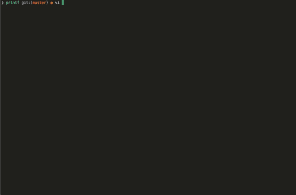

# printf
printf function similar to one from standard C library

Following standard specifiers are implemented:

|__length__| __d i__ |	__u o x X__ | __f__  |	__c__ |	__s__|	__p__|
|:--:|--|--|--|--|--|--|
|(none)	| int	| unsigned int|	double|	int |	char*|	void* |
|hh	| signed char |	unsigned char	|	| | | |
|h	| short int	|unsigned short int	|	| | | |
|l	| long int	| unsigned long int	|	| wint_t	| wchar_t*	| |
|ll |	long long int |	unsigned long long int|	| | | |
|L	| | |		long double| | | |				

Flags implemented:

|__flags__|__description__|
|:--:|--|
|-	| Left-justify within the given field width; Right justification is the default (see width sub-specifier).|
|+	| Forces to preceed the result with a plus or minus sign (+ or -) even for positive numbers. By default, only negative numbers are preceded with a - sign.|
|(space)|	If no sign is going to be written, a blank space is inserted before the value.|
|#	| Used with __o, x or X__ specifiers the value is preceeded with 0, 0x or 0X respectively for values different than zero. Used with __f__ it forces the written output to contain a decimal point even if no more digits follow. By default, if no digits follow, no decimal point is written.|
|0	| Left-pads the number with zeroes (0) instead of spaces when padding is specified (see width sub-specifier).|

|__width__|	__description__|
|:--:|--|
|(number)|	Minimum number of characters to be printed. If the value to be printed is shorter than this number, the result is padded with blank spaces. The value is not truncated even if the result is larger.|

|__.precision__|	__description__|
|:--:|--|
|.number|	For integer specifiers (d, i, o, u, x, X): precision specifies the minimum number of digits to be written. If the value to be written is shorter than this number, the result is padded with leading zeros. The value is not truncated even if the result is longer. A precision of 0 means that no character is written for the value 0.
For __f__ specifiers: this is the number of digits to be printed after the decimal point (by default, this is 6).
For __s__ this is the maximum number of characters to be printed. By default all characters are printed until the ending null character is encountered.
If the period is specified without an explicit value for precision, 0 is assumed.|
